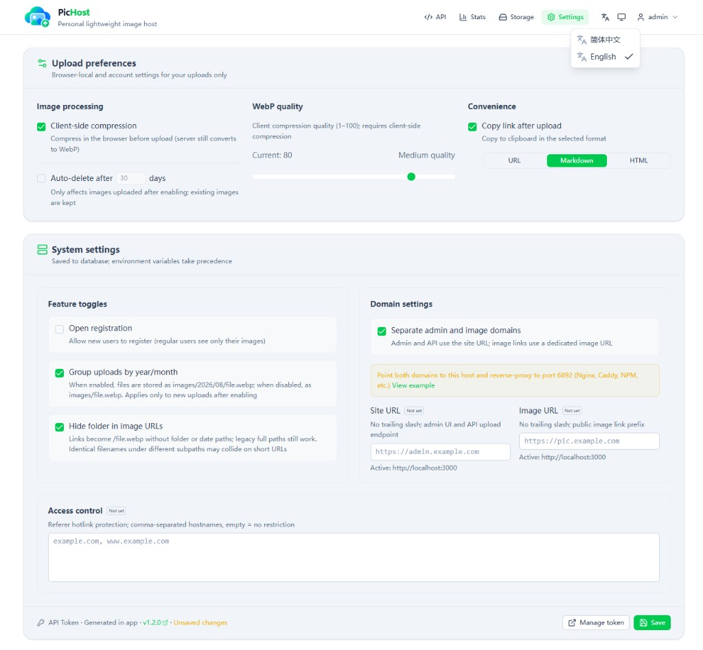

<p align="center">
  
</p>

<h1 align="center">PicHost</h1>

<p align="center"><strong>Lightweight personal image hosting</strong> · Simple uploads, clean management</p>

<p align="center">Self-hosted / Multi-user / Docker / API / Twikoo · Local disk or object storage</p>

<p align="center">
  <a href="https://github.com/O96u/PicHost/blob/main/package.json"></a>
  <a href="https://github.com/O96u/PicHost/actions/workflows/ci.yml"></a>
  
  <a href="https://hub.docker.com/r/muxui/pichost"></a>
  
</p>

<p align="center">
  <a href="https://o96u.github.io/PicHost/en/">Docs</a> ·
  <a href="#screenshots">Screenshots</a> ·
  <a href="#features">Features</a> ·
  <a href="#quick-start">Quick Start</a> ·
  <a href="README.md">简体中文</a>
</p>

---

## Screenshots

**main** has no public demo. **cloudflare** branch live demo: [pic.roven.cc](https://pic.roven.cc)

| Home | Storage |
| :--: | :-----: |
|  |  |

| Stats | Settings |
| :---: | :-------: |
|  |  |

## Features

- **Drag, click, or Ctrl+V paste** — server-side WebP, Referer hotlink protection
- **Multi-user** — login with slider captcha, optional registration; users see only their images
- **Multi-backend storage** — local disk + S3-compatible (R2 / COS / OSS / AWS); hybrid `proxy` / `public` URLs
- **Gallery & stats** — browse, search, batch delete; upload trends and source breakdown
- **API & Twikoo** — global / per-user tokens; `POST /api/index.php` compatible
- **Zero-config Docker** — first-run web wizard, no secrets upfront

## Quick Start

```bash
docker run -d \
  --name pichost \
  -p 6892:6892 \
  -v ./data:/data \
  --restart unless-stopped \
  muxui/pichost:latest
```

Open `http://<host>:6892` and complete the setup wizard.

**Full guide** (env vars, upgrades, dual-domain setup, API, Twikoo, reverse proxy, local dev, etc.): **[Documentation](https://o96u.github.io/PicHost/en/)**.

| Branch | Notes |
| ------ | ----- |
| [**main**](https://github.com/O96u/PicHost/tree/main) | Default: multi-backend, dual-domain, unified `images/` storage |
| [**cloudflare**](https://github.com/O96u/PicHost/tree/cloudflare) | Cloudflare R2 only; live demo [pic.roven.cc](https://pic.roven.cc) |

## License

[GPL-3.0](LICENSE)

## Friend links

[LINUX DO](https://linux.do/)
