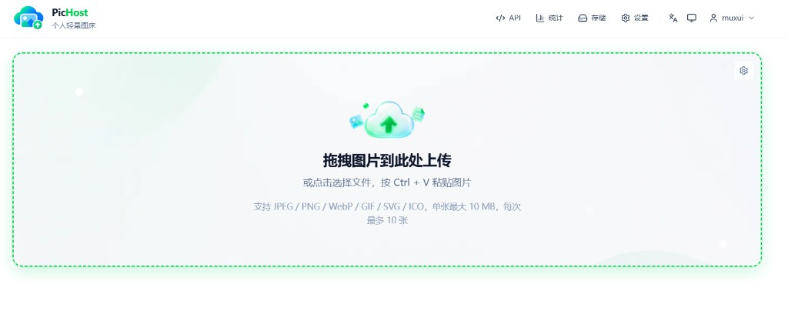
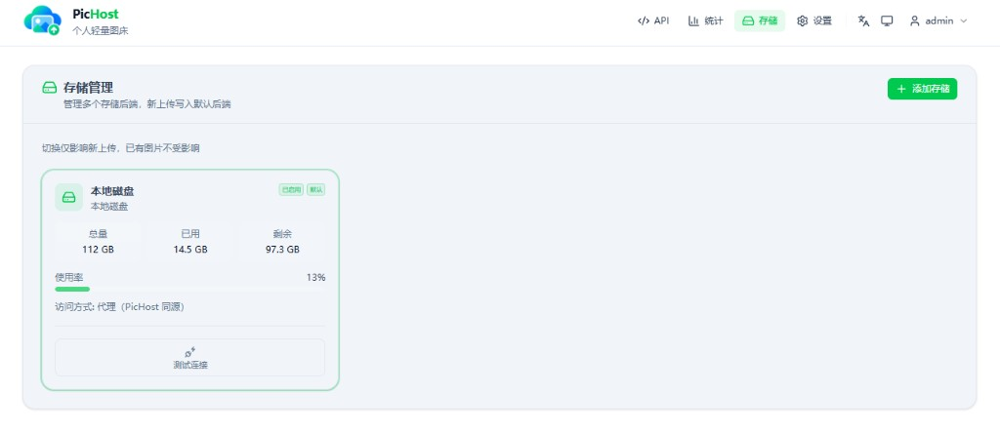
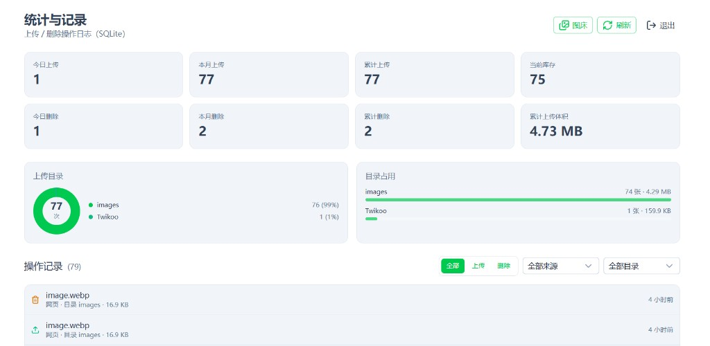
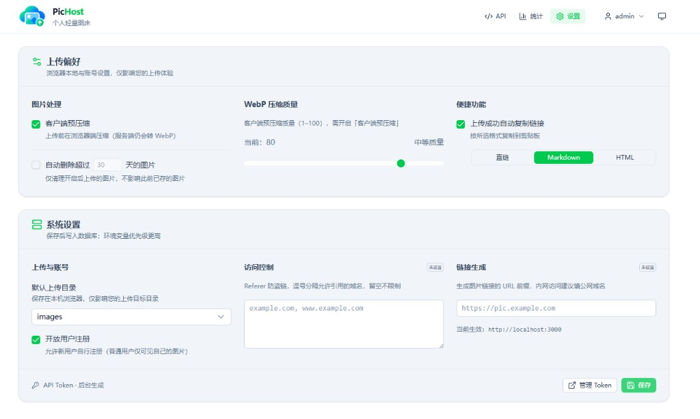
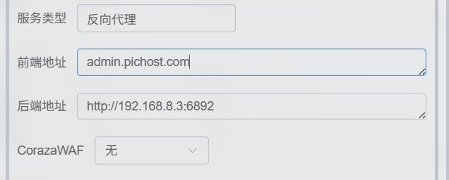
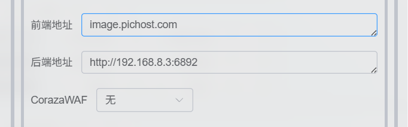

<p align="center">
  
</p>

<h1 align="center">PicHost</h1>

<p align="center"><strong>Lightweight personal image hosting</strong> · Simple uploads, clean management</p>

<p align="center">Self-hosted / Multi-user / Docker / API / Twikoo · Local disk or object storage</p>

<p align="center">
  <a href="https://github.com/O96u/PicHost/blob/main/package.json"></a>
  <a href="https://github.com/O96u/PicHost/actions/workflows/ci.yml"></a>
  
  <a href="https://hub.docker.com/r/muxui/pichost"></a>
  
</p>

<p align="center">
  <a href="#branches">Branches</a> ·
  <a href="#quick-start">Quick Start</a> ·
  <a href="#screenshots">Screenshots</a> ·
  <a href="#features">Features</a> ·
  <a href="#tech-stack">Tech Stack</a> ·
  <a href="#roadmap">Roadmap</a> ·
  <a href="README.md">简体中文</a>
</p>

---

## Branches

| Branch | Notes |
| ------ | ----- |
| [**main**](https://github.com/O96u/PicHost/tree/main) (default) | **v1.1.5** — local disk + multi-backend storage, bidirectional dual-domain isolation, [`/storage`](docs/README.md) UI, hybrid URLs |
| [**cloudflare**](https://github.com/O96u/PicHost/tree/cloudflare) | **Cloudflare R2–only line** — streamlined for deployments that use R2 exclusively |

Use **main** for the full product and multiple cloud backends.

If you **only use Cloudflare R2**, check out the dedicated branch:

```bash
git clone https://github.com/O96u/PicHost.git
cd PicHost
git checkout cloudflare
```

---

## Screenshots

|                 Upload                 |              Storage               |
| :------------------------------------: | :--------------------------------: |
|  |  |

|           Stats & gallery            |              Settings              |
| :----------------------------------: | :--------------------------------: |
|  |  |

## Features

- **Drag, click, or Ctrl+V paste** to upload; admins can use custom `folder` paths
- **Server-side WebP** (sharp), Referer hotlink protection, configurable public base URL
- **Multi-user** — username/password login; optional registration; users see only their images
- **Upload preferences** (home card flip): client-side compression, auto-copy links, per-user auto-delete
- **Multi-backend storage**: local disk + S3-compatible (Cloudflare R2 / Tencent COS / Alibaba OSS / AWS S3); admins manage backends at **Storage** (`/storage`)
- **Hybrid URLs**: `proxy` (same-origin via PicHost) or `public` (302 to CDN / bucket URL)
- **Gallery** — browse, search, batch delete; admin sees uploader badges
- **Stats** — upload/delete metrics, folder breakdown; admin sees registered user count
- **API** — global token (admin) + per-user tokens; in-app cURL snippets
- **Twikoo** — `POST /api/index.php` (`image` + `token`)
- **Zero-config Docker** — first-run web wizard, no secrets required upfront

## Quick Start

### Docker (recommended)

```bash
docker run -d \
  --name pichost \
  -p 6892:6892 \
  -v ./data:/data \
  --restart unless-stopped \
  muxui/pichost:latest
```

Default port: **6892**. Open `http://<host>:6892` in your browser and complete the setup wizard.

**Forgot password** (requires `docker exec` / server access):

```bash
docker exec pichost reset-password              # admin only, when there is exactly one
docker exec pichost reset-password <username>   # admin or regular user
```

A random password is printed. Fails if the user does not exist.

If you cloned the repo, you can also use `docker compose up -d` (see `docker-compose.yml`).

### Local development

```bash
npm install
cp .env.example .env   # optional
npm run dev
```

Open `http://localhost:3000/setup` to create the admin account. Data defaults to `./data`.

## Tech Stack

| Layer    | Technology                                          |
| -------- | --------------------------------------------------- |
| Frontend | Nuxt 4, Vue 3, Nuxt UI 4, Tailwind CSS 4            |
| Backend  | Nitro (Node.js), SQLite                             |
| Images   | sharp (WebP transcoding & compression)              |
| Auth     | Session cookie, scrypt password hashing, API tokens |
| Storage  | Local disk + S3-compatible backends (R2 / COS / OSS / AWS); `images` index in SQLite |
| Deploy   | Docker (amd64 / arm64), docker compose              |
| Tests    | Vitest                                              |

## Users & permissions

| Scenario                       | Auth                 | Ownership / visibility      |
| ------------------------------ | -------------------- | --------------------------- |
| Web upload                     | Session              | Current user                |
| API upload + **user token**    | `Auth-Token`         | Token owner                 |
| API upload + **global token**  | `Auth-Token`         | Admin (`userId` null)       |
| Twikoo `/api/index.php`        | form `token`         | Same as global token        |
| Gallery list / search / delete | Session or token     | Users: own only; admin: all |
| Direct link `GET /images/...`  | None (Referer rules) | Public if URL is known      |

Regular users are limited to the `images/` folder; custom `folder` requires admin or global token.

## Storage layout

```
/data
├── pichost.db          # SQLite: users, sessions, settings, storage_backends, images index
├── images/             # Default upload folder (when using local backend)
├── blog/               # Example custom folder
└── twikoo/             # Twikoo comment images
```

Pattern: `folder/YYYY/MM/randomId.webp` + `.meta.json`. With cloud backends, blobs live in the bucket; SQLite `images` tracks `backend_id` and `key`. Back up all of `/data` plus bucket data.

## API overview

| Method | Path                 | Description            |
| ------ | -------------------- | ---------------------- |
| POST   | `/api/images/upload` | Upload image           |
| GET    | `/api/images`        | Paginated list         |
| DELETE | `/api/images`        | Delete one (`key`)     |
| POST   | `/api/index.php`     | Twikoo / EasyImage 2.0 |

Upload example:

```bash
curl -X POST "https://pic.example.com/api/images/upload" \
  -H "Auth-Token: YOUR_TOKEN" \
  -F "folder=blog" \
  -F "image=@./demo.png"
```

Full docs and copyable cURL snippets are on the **API** page after deployment.

## Twikoo

| Setting           | Value                               |
| ----------------- | ----------------------------------- |
| `IMAGE_CDN`       | `easyimage`                         |
| `IMAGE_CDN_URL`   | `https://your-domain/api/index.php` |
| `IMAGE_CDN_TOKEN` | Same as `API_UPLOAD_TOKEN`          |

## Reverse proxy

- Proxy to port **6892**; HTTPS recommended
- Nginx: `client_max_body_size` ≥ 12m
- Set `IMAGE_BASE_URL` (single domain) or `SITE_BASE_URL` + `IMAGE_BASE_URL` (dual-domain separation)

### Recommended architecture (dual domains)

**One Docker instance + two domains**, both fully proxied to `6892` (isolation via PicHost middleware):

```nginx
# admin.example.com — admin + API + images
server {
  server_name admin.example.com;
  location / {
    proxy_pass http://127.0.0.1:6892;
    proxy_set_header Host $host;
    proxy_set_header X-Forwarded-Proto $scheme;
    client_max_body_size 12m;
  }
}

# pic.example.com — same full proxy; PicHost middleware blocks non-image paths
server {
  server_name pic.example.com;
  location / {
    proxy_pass http://127.0.0.1:6892;
    proxy_set_header Host $host;
    proxy_set_header X-Forwarded-Proto $scheme;
  }
}
```

FN NAS [Lucky](https://github.com/gdy666/lucky) reverse proxy (public hostname → backend `http://<LAN-IP>:6892`):

| Site domain (admin) | Image domain |
| :-----------------: | :----------: |
|  |  |

See **[docs/domain-separation.en.md](docs/domain-separation.en.md)** for Caddy/NPM notes, env vars, and setup fields.

## Development

```bash
npm run dev          # Dev server
npm run build        # Production build
npm run start        # Run .output
npm run lint         # ESLint
npm run typecheck    # Type check
npm test             # Unit tests
```

## Roadmap

| Version    | Plan                                                           |
| ---------- | -------------------------------------------------------------- |
| **v1.1.5** | Gallery preview reliability: auto-retry, storage verify, no-cache errors (current `main`) |
| **v1.1.4** | Flat vs date storage paths, basename public URLs, bidirectional domain isolation |
| **v1.1.3** | Dual-domain separation, optional `images/` URL prefix, update check |
| **v1.1.2** | Activity logs, gallery storage filter, upload rate limits |
| **v1.1.1** | Session check fixes, storage placeholder cleanup, Docker logging |
| **v1.1.0** | Multi-backend object storage, hybrid URLs, storage UI |
| **v1.0.4** | Password visibility toggle, legacy ADMIN_SECRET migration      |
| **v1.0.3** | CI and Docker multi-arch build fixes                           |
| **v1.0.2** | i18n, mobile menus, stats/upload UI, Docker password reset     |
| **v1.0.1** | Settings version display, mobile upload preferences layout fix |
| **v1.0.0** | Local storage, multi-user, API, Twikoo                         |

## License

[GPL-3.0](LICENSE)

## Friend links

[LINUX DO](https://linux.do/)
