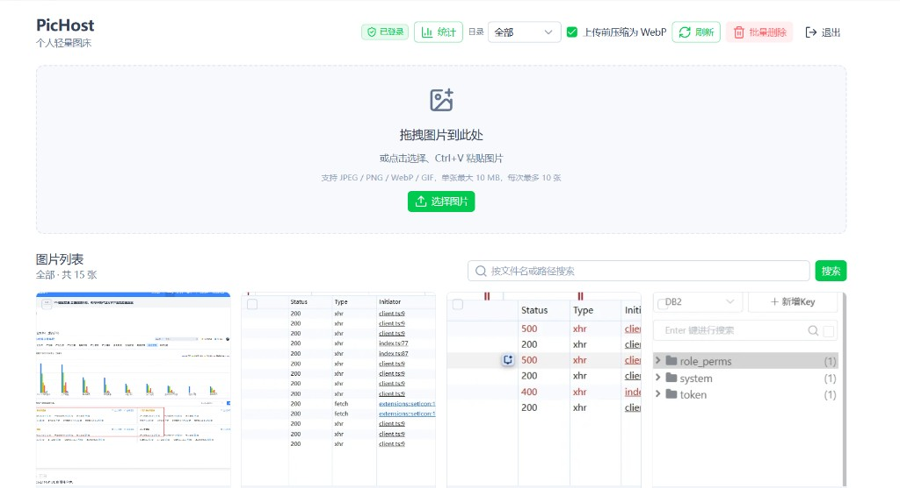

# PicHost - 轻量自托管图床

> 本分支是 **Cloudflare Pages + R2 + Worker** 版。
> **NAS / Docker 自托管版**（本地磁盘存储、服务端 WebP 压缩、单容器部署）请见 [`main` 分支](https://github.com/O96u/PicHost/tree/main)，预构建镜像：`muxui/pichost:latest`。

基于 Cloudflare 的图床系统：Nuxt 4 管理后台 + R2 存储 + 独立图片访问 Worker。适合个人博客、评论系统等场景自部署。

文档中的示例域名：`pic.example.com`（管理后台）、`img.example.com`（图片 CDN），部署时请替换为你自己的域名。

## 效果预览

<p align="center">
  
</p>

<p align="center"><b>登录</b> — 管理密钥验证，可选 Cloudflare Turnstile 人机校验。</p>

<p align="center">
  
</p>

<p align="center"><b>管理后台</b> — 拖拽 / 点击 / 粘贴上传，目录筛选、搜索与批量管理。</p>

> NAS / Docker 版还包含统计与操作日志，截图见 [`main` 分支](https://github.com/O96u/PicHost/tree/main#效果预览)。

## 架构

```
浏览器
  │
  ├─ pic.example.com ──► Cloudflare Pages (Nuxt 4)
  │                     ├─ 登录 / 上传 / 管理
  │                     └─ API ──► R2 (IMAGES binding)
  │
  └─ img.example.com ──► Cloudflare Worker (image-proxy)
                        └─ 读取 R2（私有，不公开）
```

| 组件 | 域名 | 部署方式 |
|------|------|----------|
| 管理后台 | `pic.example.com` | Cloudflare Pages |
| 图片访问 | `img.example.com` | Cloudflare Worker |
| 存储 | — | Cloudflare R2（私有） |

## 功能

- 拖拽 / 点击 / 粘贴 / 多图上传
- 可选浏览器端 WebP 压缩
- 复制直链 / Markdown / HTML
- 图片列表（R2 cursor 分页）
- 单张 / 批量删除
- 管理密钥登录 + 可选 Turnstile 人机验证
- 基础防盗链

## 目录结构

```
pic/
├── app/                      # Nuxt 前端
│   ├── components/           # 上传、列表、登录等组件
│   └── composables/          # 业务逻辑
├── server/                   # Nitro API（Pages Functions）
│   ├── api/                  # 接口
│   └── utils/                # R2、鉴权、Turnstile 等
├── workers/image-proxy/      # 图片访问 Worker
├── wrangler.jsonc            # Pages R2 绑定
└── nuxt.config.ts
```

## 前置要求

- Node.js 20+
- npm
- Cloudflare 账号
- Wrangler（项目已包含 devDependency）

## 一、安装

```bash
npm install
cd workers/image-proxy && npm install && cd ../..
```

## 二、创建 R2 Bucket

```bash
npx wrangler login
npx wrangler r2 bucket create personal-images
```

在 Cloudflare Dashboard → R2 → `personal-images`：

- **禁用** `r2.dev` 公共访问
- **不要**绑定公开自定义域名

## 三、环境变量

**所有配置均在服务端设置，Pages 项目不需要配置任何 `NUXT_PUBLIC_*` 变量。**

### 管理后台（Pages 项目 `pic-host`）

在 Dashboard → **pic-host** → **设置** → **变量和密钥** 中配置：

| 类型 | 名称 | 必填 | 说明 |
|------|------|------|------|
| Secret | `ADMIN_SECRET` | 是 | 管理后台登录密钥，自行生成强随机字符串 |
| Secret | `API_UPLOAD_TOKEN` | 是* | Twikoo / EasyImage / 油猴脚本上传用，与 `ADMIN_SECRET` 分开；未配则 `/api/index.php` 报 500 |
| 变量 | `IMAGE_BASE_URL` | 是 | 图片 CDN 域名，如 `https://img.example.com` |
| 变量 | `IMAGE_WORKER_PURGE_URL` | 否 | 删除后缓存清理地址，如 `https://img.example.com/__internal/purge` |
| Secret | `INTERNAL_PURGE_TOKEN` | 否 | 与图片 Worker 共用的清理 Token |
| 变量 | `TURNSTILE_SITE_KEY` | 否 | Turnstile Site Key（人机验证） |
| Secret | `TURNSTILE_SECRET` | 否 | Turnstile Secret Key |

命令行设置 Secret：

```powershell
cd /path/to/pic
npx wrangler pages secret put ADMIN_SECRET --project-name pic-host
npx wrangler pages secret put API_UPLOAD_TOKEN --project-name pic-host
npx wrangler pages secret put INTERNAL_PURGE_TOKEN --project-name pic-host
npx wrangler pages secret put TURNSTILE_SECRET --project-name pic-host
```

普通变量（`IMAGE_BASE_URL` 等）在 Dashboard 中添加即可。**加密密钥（Secret）修改后，建议再触发一次部署**，确保当前 Production 版本能读到。

**登录提示「未配置 ADMIN_SECRET」**

1. 变量名必须完全是 **`ADMIN_SECRET`**（全大写，无 `NUXT_` 前缀）。
2. Dashboard → **pic-host** → **设置** → **变量和密钥** 里，在 **「生产环境 / Production」** 下添加（不要只配 Preview）。自定义域 `pic.example.com` 走的是 **Production**。
3. 打开 `https://pic.example.com/api/auth/config`，看返回里的 **`adminSecretConfigured`** / **`apiUploadTokenConfigured`**：
   - `false`：当前这次部署的运行时没读到 Secret（环境配错、只配了 Preview、或需重新部署）。
   - `true`：Secret 已生效，若仍无法登录则是密钥输入错误（会提示「密钥错误」而非「未配置」）。
4. Twikoo 报「服务端未配置 API_UPLOAD_TOKEN」时，先看 **`apiUploadTokenConfigured`** 是否为 `true`；为 `false` 说明配在了错误项目（如 image-proxy）、只配了 Preview、或变量名不是 **`API_UPLOAD_TOKEN`**（不要用 `NUXT_` 前缀，除非同时按 Nuxt 文档映射）。
5. GitHub Actions 部署已带 **`--branch=main`**，与 Production 分支一致；请在 Pages 项目设置里确认 **生产分支 = `main`**。

### 图片 Worker（`workers/image-proxy`）

**不要在 `wrangler.jsonc` 里写 `vars`（尤其是 `ALLOWED_REFERER_HOSTS`）**：每次 `wrangler deploy` / GitHub Actions 部署都会用配置文件**覆盖** Worker 上的变量，你在 Dashboard 里后期加的域名会丢失。

请在 **Workers & Pages → image-proxy → 设置 → 变量和密钥** 中配置（部署不会删除未写在 wrangler 里的变量）：

| 类型 | 名称 | 说明 |
|------|------|------|
| 变量 | `ALLOWED_REFERER_HOSTS` | 逗号分隔的 hostname，如 `example.com,www.example.com,pic.example.com,你的博客域` |
| 变量 | `PUBLIC_IMAGE_ORIGIN` | `https://img.example.com`（删图清缓存用） |
| Secret | `INTERNAL_PURGE_TOKEN` | 与 pic-host 相同 |

首次可参考默认值：

```
ALLOWED_REFERER_HOSTS=example.com,www.example.com,pic.example.com
PUBLIC_IMAGE_ORIGIN=https://img.example.com
```

命令行设置 Secret：

```powershell
cd workers/image-proxy
npx wrangler secret put INTERNAL_PURGE_TOKEN
```

`INTERNAL_PURGE_TOKEN` 在 **pic-host** 与 **image-proxy** 须为**同一串**（仅用于删图后调用 `POST /__internal/purge`）。与删除接口报「无效的图片路径」**无关**——那是 key 格式校验未通过（见下文）。

### 本地开发

复制 `.env.example` 为 `.env`：

```bash
cp .env.example .env
```

```env
ADMIN_SECRET=dev-secret
IMAGE_BASE_URL=http://localhost:8787
DEV_BYPASS_ACCESS=true
```

## 四、R2 绑定

两个项目绑定同一个 Bucket，binding 名称均为 `IMAGES`：

**Pages**：Dashboard → pic-host → 设置 → 绑定 → R2 → `personal-images`

**Worker**：`workers/image-proxy/wrangler.jsonc` 中已配置。

## 五、Turnstile 人机验证（可选）

### 创建小组件

Dashboard → **Turnstile** → **Add widget**

| 项 | 值 |
|---|---|
| 域名 | `pic.example.com`、`localhost`、`127.0.0.1` |
| 模式 | Managed |

### 配置变量

**两个都配才生效**，只配一个则自动跳过：

```
TURNSTILE_SITE_KEY  →  Site Key（普通变量）
TURNSTILE_SECRET    →  Secret Key（Secret）
```

### 工作流程

1. 登录页加载时请求 `GET /api/auth/config`
2. 若 Turnstile 已配置，服务端返回 `siteKey`，前端渲染验证码
3. 点击登录时，服务端先校验 Turnstile，再校验 `ADMIN_SECRET`
4. 上传 / 列表 / 删除等操作不再重复验证

## 六、登录与鉴权

- 使用 `ADMIN_SECRET` 密钥登录，非用户名密码
- 登录后设置 httpOnly Cookie（7 天有效）
- 未登录时只显示登录页，无法操作后台
- 未登录的请求**不会访问 R2**（在鉴权层即被拒绝）

## 七、本地开发

```powershell
# 管理后台
npm run dev

# 图片 Worker（另一终端）
npm run worker:dev
```

## 八、部署

### 图片 Worker

```powershell
cd workers/image-proxy
npx wrangler secret put INTERNAL_PURGE_TOKEN
npm run deploy
```

**重新部署后自定义域访问异常？**

`wrangler deploy` 会按 `workers/image-proxy/wrangler.jsonc` 同步 Worker 配置。仓库默认 **不在** `wrangler.jsonc` 里写 `routes`（避免绑定到他人域名）；请在 **Workers & Pages → image-proxy → 设置 → 域和路由** 添加你的图片域名（如 `img.example.com`），或在本地 `wrangler.jsonc` 中自行配置 `routes` 后部署。若 CI 部署后访问异常，请检查：

1. **Workers & Pages** → **image-proxy** → **设置** → **域和路由**，确认已绑定你的图片域名；没有则手动 **添加自定义域** 或再执行一次 `npm run worker:deploy`。
2. 确认 GitHub Actions 用的 `CLOUDFLARE_ACCOUNT_ID` 与手动部署时**同一账号**（否则像是「部署到了别的账号的 Worker」）。
3. 使用 `custom_domain: true` 时，pattern 填整域（如 `img.example.com`），不要写成 `img.example.com/*`。
4. Worker 的 **Secret**（如 `INTERNAL_PURGE_TOKEN`）在 Dashboard 里单独保存，**不会因代码部署而清空**；域名访问异常时多半是路由/域配置未同步，不是 Secret 丢失。

### 管理后台

```powershell
cd /path/to/pic
npm run build
npx wrangler pages deploy dist --project-name pic-host
```

**代码变更后需要重新 build + deploy。环境变量 / Secret 修改通常无需重新部署。**

### GitHub Actions 自动部署

推送 `main` 分支或手动运行 **Deploy to Cloudflare** 工作流时，会依次：lint → typecheck → 构建 Pages → 部署 `pic-host` → 部署 `image-proxy` Worker。

在 GitHub 仓库 **Settings → Secrets and variables → Actions** 中添加：

| Secret | 说明 |
|--------|------|
| `CLOUDFLARE_API_TOKEN` | [创建 API Token](https://dash.cloudflare.com/profile/api-tokens)，建议模板 **Edit Cloudflare Workers**，并勾选 **Account → Cloudflare Pages → Edit**、**Account → Workers R2 Storage → Edit**（若通过 wrangler 同步 R2 绑定） |
| `CLOUDFLARE_ACCOUNT_ID` | Cloudflare **Account ID**（32 位十六进制）。在 Dashboard 首页右侧或 **Workers & Pages** 概览里复制。**不要**填 Zone ID。仓库里**不写** `account_id`（本地与 CI 均用该 Secret / `wrangler login` 默认账号）。根目录 `wrangler.jsonc` 仅供 Pages，**不要**写 `account_id`（Wrangler 4 Pages 会报错）。 |

首次部署时 workflow 会尝试创建 Pages 项目 **`pic-host`**（若不存在）。创建后请在 Dashboard → **pic-host** → **设置** 中绑定 R2 `personal-images`（binding 名 `IMAGES`）、配置环境变量与自定义域；Worker 的 Secret 仍按上文手动配置。

**Actions 部署失败 `7003` / `Could not route`**

1. 核对 GitHub Secret `CLOUDFLARE_ACCOUNT_ID` 是否为 **Account ID**（32 位十六进制），不是域名 Zone ID。  
2. API Token 须为 **账户级**，权限包含 **Cloudflare Pages → Edit**（仅 Zone 权限不够）。  
3. 本地验证（已 `wrangler login` 或导出与 CI 相同的 `CLOUDFLARE_API_TOKEN` + `CLOUDFLARE_ACCOUNT_ID`）：
   ```bash
   npx wrangler whoami
   npx wrangler pages project list
   ```
   列表里应能看到 `pic-host`，或执行 `npx wrangler pages project create pic-host --production-branch=main`。

**不必**在 Cloudflare Dashboard 里把本仓库接成「Git 集成 / 自动构建」——那会与 GitHub Actions 重复部署。

仓库根目录 `package.json` 中 `packageManager` 固定 **npm 11**；CI 会在 `npm ci` 前执行 `npm install -g npm@11.12.1`。若仍报 lock 不同步，请在本地执行 `npx npm@10.9.2 install --package-lock-only` 后提交 `package-lock.json`（当前 lock 已兼容 npm 10 / 11）。

本地等价命令：

```bash
npm run deploy:pages
npm run worker:deploy
```

### 绑定自定义域名

- Worker：在 Dashboard 添加图片域名（如 `img.example.com`），或在 `workers/image-proxy/wrangler.jsonc` 中配置 `routes` 后部署
- Pages：Dashboard → pic-host → 自定义域 → 添加管理后台域名（如 `pic.example.com`）

## 九、防盗链与防 R2 盗刷

### 9.1 先分清三种「被刷」

| 类型 | 表现 | 防盗链有用吗 | 主要靠什么 |
|------|------|--------------|------------|
| **网页盗链** | 别人网站用 `` | ✅ 有用 | Referer 白名单 |
| **直链 CC** | 拿着 URL 用脚本狂刷 | ❌ 没用 | WAF 限速 + 缓存 |
| **撞库/遍历** | 猜路径扫你整个桶 | 部分有用 | 随机文件名 + 私有 R2 |

防盗链 **不能** 当 DDoS/CC 防护。空 Referer（地址栏打开）是允许的，攻击者也可以不带 Referer 刷。

### 9.2 你已经具备的防护（默认就有）

1. **R2 私有**  
   - 关闭 `r2.dev` 公共访问  
   - 不绑定公开 R2 域名  
   - 外界 **不能** 直接访问 Bucket，只能走 `img.example.com` Worker  

2. **Worker 不列目录**  
   - 没有 list API 对外暴露  
   - 只能按完整 key 读单张图  

3. **随机不可猜测的文件名**  
   - `images/YYYY/MM/随机ID.ext`  
   - 降低被遍历扫光的概率  

4. **Referer 防盗链**（`ALLOWED_REFERER_HOSTS`）  

| Referer | 结果 |
|---------|------|
| 白名单域名 | 允许 |
| 空 Referer | 允许（直接访问、部分客户端） |
| 其他域名 | 403 |

仅精确匹配 hostname，防止 `xxx.evil.com` 类绕过。

5. **边缘缓存**（Cache API + Cache-Control）  
   - 同一张图重复访问，多数命中缓存，**少打 R2**  
   - 盗刷时主要消耗的是 Worker/CDN 请求配额，而不是每次都读 R2  

6. **上传受保护**  
   - 网页：`ADMIN_SECRET` 登录  
   - 脚本：`API_UPLOAD_TOKEN`  
   - 外人不能往你桶里塞垃圾文件  

### 9.3 强烈建议你在 Dashboard 再做的（防 CC）

#### A. 预算警报（防天价账单）

Cloudflare → **账单 / Billing** → **添加预算警报**  

建议设：**$1** 或 **$5**。有异常用量立刻邮件通知。

#### B. WAF Rate Limiting（防单 IP 狂刷）

路径：你的根域名（如 `example.com`）→ **Security** → **WAF** → **Rate limiting rules**

**规则 1：图片域名限速**

| 项 | 建议值 |
|----|--------|
| 匹配 | Hostname = `img.example.com` |
| 阈值 | 例如 **60 次 / 分钟 / IP**（可按需调） |
| 动作 | Block 或 Managed Challenge |

**规则 2：上传接口限速**

| 项 | 建议值 |
|----|--------|
| 匹配 | Hostname = `pic.example.com` 且 URI Path 含 `/api/images/upload` |
| 阈值 | 例如 **20 次 / 分钟 / IP** |
| 动作 | Block |

**规则 3：登录接口限速**

| 项 | 建议值 |
|----|--------|
| 匹配 | Path = `/api/auth/login` |
| 阈值 | 例如 **10 次 / 分钟 / IP** |
| 动作 | Managed Challenge 或 Block |

> 免费计划 WAF 能力因套餐而异；若没有 Rate limiting，至少打开 **Bot Fight Mode** / 基础防护，并保留预算警报。

#### C. 确认 R2 始终私有

R2 → `personal-images` → Settings：

- [ ] **未启用** r2.dev 公共访问  
- [ ] **未绑定** 公开自定义域名到 Bucket  
- [ ] 仅通过 Worker Binding `IMAGES` 访问  

#### D. 白名单只加你需要的站

在 **Workers & Pages → image-proxy → 设置 → 变量和密钥** 中设置 `ALLOWED_REFERER_HOSTS`（勿写入 `wrangler.jsonc` 的 `vars`，避免 deploy 覆盖）：

```
ALLOWED_REFERER_HOSTS=example.com,www.example.com,pic.example.com,forum.example.com
```

改完后重新部署 Worker（若仅改 Dashboard 变量，通常无需重新部署）：

```powershell
cd workers/image-proxy
npm run deploy
```

论坛要用图，就把论坛域名加进去；**不要**写成 `*` 或过宽规则。

### 9.4 缓存如何减轻 R2 被刷

```
攻击请求 → img.example.com
              ├─ 缓存命中 → 边缘直接返回（几乎不碰 R2）✅
              └─ 缓存未命中 → Worker → R2（才产生 R2 读取）
```

已设置：

```
Cache-Control: public, max-age=86400, s-maxage=604800, stale-while-revalidate=86400
```

含义：

- 浏览器可缓存约 1 天  
- CDN/边缘可缓存更久  
- **同一 URL 被刷时，R2 压力远小于无缓存**  

注意：缓存 **不能** 阻止请求次数上涨，只能减少回源 R2。

### 9.5 超免费额度后会发生什么

| 产品 | 超额大致行为 |
|------|----------------|
| Workers 免费 | 当天请求可能被拒绝，一般不按超出狂扣费 |
| R2 | 超出免费额度后可能按量计费 |

所以：**预算警报 + 限速** 比「只靠防盗链」重要。

### 9.6 更高级方案（个人一般不必上）

| 方案 | 说明 |
|------|------|
| 签名 URL | 链接带过期时间与签名，泄露后短时失效 |
| Cloudflare Access | 整站私有，不适合公开博客贴图 |
| 禁止空 Referer | 更严，但地址栏/部分 App/RSS 会坏图 |

当前「空 Referer 允许 + 白名单站点允许」是个人图床的实用折中。

### 9.7 自检清单

- [ ] R2 无私有公共访问  
- [ ] 图片只通过 `img.example.com` 访问  
- [ ] `ALLOWED_REFERER_HOSTS` 只含你的站点  
- [ ] 已设账单预算警报（$1～$5）  
- [ ] 已对 `img.example.com` 做 Rate Limiting（若套餐支持）  
- [ ] `API_UPLOAD_TOKEN` / `ADMIN_SECRET` 未泄露、足够长  
- [ ] 未把 `*.workers.dev` 当图床域名到处贴（可减少被扫）  

## 十、缓存与删除

图片缓存头：

```
Cache-Control: public, max-age=86400, s-maxage=604800, stale-while-revalidate=86400
```

删除图片后，后台调用 Worker 内部接口清理缓存：

```
POST https://img.example.com/__internal/purge
Authorization: Bearer <INTERNAL_PURGE_TOKEN>
{ "keys": ["images/2026/07/xxx.webp"] }
```

## 十一、API 概览

| 方法 | 路径 | 鉴权 | 说明 |
|------|------|------|------|
| GET | `/api/auth/config` | 无 | 获取登录配置（含 Turnstile） |
| POST | `/api/auth/login` | 无 | 登录 |
| POST | `/api/auth/logout` | 无 | 退出 |
| GET | `/api/auth/me` | Cookie | 检查登录状态 |
| POST | `/api/images/upload` | Cookie 或 API Token | 上传图片 |
| POST | `/api/index.php` | 表单 `token`（EasyImage 2.0） | Twikoo 等图床兼容上传 |
| GET | `/api/images` | Cookie | 图片列表（分页 cursor） |
| GET | `/api/images/count` | Cookie | 桶内图片总数 |
| GET | `/api/images/search?q=` | Cookie | 按路径/原始文件名搜索 |
| POST | `/api/images/batch-delete` | Cookie | 批量删除 |
| DELETE | `/api/images?key=` | Cookie | 删除单张 |

## 十二、外部脚本上传（博客 / 论坛 / 油猴）

网页后台用 `ADMIN_SECRET` 登录；油猴脚本请使用单独的 **`API_UPLOAD_TOKEN`**（不要把登录密钥写进脚本）。

### 1. 配置 Token

Pages → pic-host → 变量和密钥 → 添加 Secret：

```
API_UPLOAD_TOKEN = 一串长随机字符串
```

### 2. 上传接口

```http
POST https://pic.example.com/api/images/upload
Authorization: Bearer <API_UPLOAD_TOKEN>
Content-Type: multipart/form-data

字段名：files / file / image（任选其一）
```

成功响应示例：

```json
{
  "success": true,
  "items": [
    {
      "key": "images/2026/07/xxxx.webp",
      "url": "https://img.example.com/images/2026/07/xxxx.webp",
      "markdown": "",
      "html": ""
    }
  ],
  "errors": []
}
```

### 3. curl 示例

```bash
curl -X POST "https://pic.example.com/api/images/upload" \
  -H "Authorization: Bearer 你的API_UPLOAD_TOKEN" \
  -F "file=@./demo.png"
```

### 3.1 Twikoo 评论（EasyImage 2.0 图床）

Twikoo 在 Vercel / 私有部署下上传评论图片时，可走 [EasyImage 2.0 接口](https://twikoo.js.org/faq.html#vercel%E3%80%81%E7%A7%81%E6%9C%89%E9%83%A8%E7%BD%B2%E6%97%A0%E6%B3%95%E4%B8%8A%E4%BC%A0%E5%9B%BE%E7%89%87)。在本项目中已兼容 `POST /api/index.php`（字段 `image` + `token`）。

在 Twikoo 管理面板中配置：

| 配置项 | 值 |
|--------|-----|
| 图床类型 | `easyimage`（或 `IMAGE_CDN` = easyimage） |
| `IMAGE_CDN_URL` | `https://pic.example.com/api/index.php`（你的 Pages 域名 + 路径） |
| `IMAGE_CDN_TOKEN` | 与 Pages 中的 `API_UPLOAD_TOKEN` 相同 |

成功时返回 EasyImage 格式 JSON（`code: 200`、`result: success`、`url` 为 `IMAGE_BASE_URL` 下的图片地址）。评论里展示的图片域名一般为 `img.example.com`，若博客不在 Referer 白名单内，请在 Worker 的 `ALLOWED_REFERER_HOSTS` 中加入博客域名。

```bash
curl -X POST "https://pic.example.com/api/index.php" \
  -F "token=你的API_UPLOAD_TOKEN" \
  -F "image=@./demo.png"
```

### 4. 论坛油猴脚本适配

在原脚本中增加类型 `PicHost`，配置示例：

```js
const imgHost = {
  type: "PicHost",
  url: "https://pic.example.com",          // 管理后台域名（不是 img）
  token: "你的API_UPLOAD_TOKEN",
};
```

上传函数示例：

```js
async function uploadToPicHost(file) {
  return new Promise((resolve, reject) => {
    const formData = new FormData();
    formData.append('file', file);

    GM_xmlhttpRequest({
      method: 'POST',
      url: `${imgHost.url}/api/images/upload`,
      headers: {
        Authorization: `Bearer ${imgHost.token}`,
      },
      data: formData,
      onload: (rsp) => {
        if (rsp.status !== 200) {
          log(`图片上传失败: ${rsp.status} ${rsp.statusText}`, 'red');
          reject(rsp.statusText);
          return;
        }
        const rspJson = JSON.parse(rsp.responseText);
        const item = rspJson?.items?.[0];
        if (rspJson.success && item?.url) {
          insertToEditor(item.markdown || ``);
          resolve();
        } else {
          log(`图片上传失败: ${JSON.stringify(rspJson)}`, 'red');
          reject(rspJson);
        }
      },
      onerror: (error) => {
        log(`图片上传失败: ${error.status} ${error.statusText}`, 'red');
        reject(error);
      },
    });
  });
}
```

并在 `uploadImage` 的分支里加上：

```js
} else if (imgHost.type === 'PicHost') {
  await uploadToPicHost(file);
}
```

> 注意：`url` 填 **`https://pic.example.com`**（上传 API），图片直链会返回 `https://img.example.com/...`。  
> Token 写在脚本里有泄露风险，请与 `ADMIN_SECRET` 分开，泄露后只轮换 `API_UPLOAD_TOKEN`。

## 十三、常用命令

```bash
npm run dev            # 本地开发
npm run build          # 构建
npm run lint           # ESLint
npm run typecheck      # TypeScript 检查
npm run worker:dev     # 本地 Worker
npm run worker:deploy  # 部署 Worker
```

## 十四、安全建议

- `ADMIN_SECRET` 使用 20 位以上随机字符串
- `API_UPLOAD_TOKEN` 与登录密钥分开，泄露后只轮换上传 Token
- Turnstile 两个变量成对配置，或都不配
- R2 保持私有，禁用 `r2.dev`
- 不上传 SVG
- 秘密仅存服务端，不写入代码仓库
- 可在 WAF 中对 `/api/auth/login` 和 `/api/images/upload` 配置限速

## License

MIT
