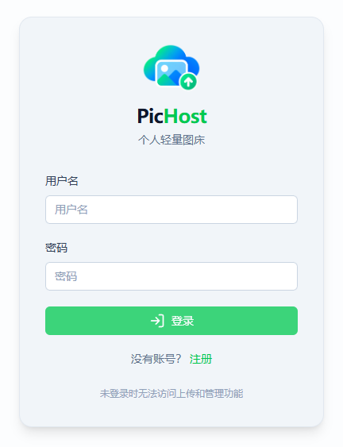
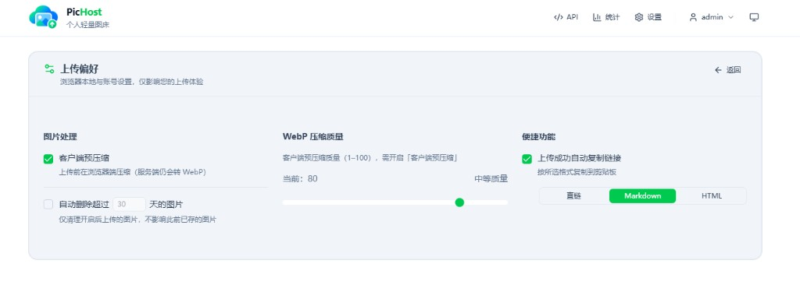

<p align="center">
  
</p>

<h1 align="center">PicHost</h1>

<p align="center"><strong>个人轻量图床</strong> · 图片放好，管理也要顺手</p>

<p align="center">自托管图床 / 多用户 / Docker / API / Twikoo · 零配置引导</p>

<p align="center">
  <a href="https://github.com/O96u/PicHost/blob/main/package.json"></a>
  <a href="https://github.com/O96u/PicHost/actions/workflows/ci.yml"></a>
  
  <a href="https://hub.docker.com/r/muxui/pichost"></a>
  
</p>

<p align="center">
  <a href="#快速开始">快速开始</a> ·
  <a href="#界面预览">预览</a> ·
  <a href="#特性">特性</a> ·
  <a href="#技术栈">技术栈</a> ·
  <a href="#路线图">路线图</a> ·
  <a href="README.en.md">English</a>
</p>

---

## 界面预览

| 登录 | 上传 |
|:---:|:---:|
|  |  |

| 上传偏好 | 统计与图库 |
|:---:|:---:|
|  |  |

| 系统设置 | |
|:---:|:---:|
|  | |

## 特性

- **拖拽 / 点击 / Ctrl+V 粘贴**上传；管理员可自定义 `folder` 目录
- **服务端 WebP 压缩**（sharp）、Referer 防盗链、可配置访问域名
- **多用户**：账号密码登录；管理员可开放注册；普通用户仅见自己的图片
- **上传偏好**（卡片翻转设置）：客户端预压缩、自动复制链接、按用户自动删除
- **图库**：浏览、搜索、批量删除；管理员可查看上传者标签
- **统计**：上传/删除趋势、目录分布；管理员额外显示注册用户数量
- **API**：全局 Token（管理员）+ 每用户个人 Token；后台可复制 cURL
- **Twikoo**：`POST /api/index.php`（`image` + `token`）
- **Docker 零配置**：首次访问 Web 引导创建管理员，无需预先写密钥

## 快速开始

### Docker（推荐）

```bash
docker run -d \
  --name pichost \
  -p 6892:6892 \
  -v ./data:/data \
  --restart unless-stopped \
  muxui/pichost:latest
```

默认端口 **6892**。浏览器打开 `http://<主机IP>:6892`，按引导创建管理员即可。

已克隆仓库时也可用 `docker compose up -d`（见仓库内 `docker-compose.yml`）。

### 本地开发

```bash
npm install
cp .env.example .env   # 可选
npm run dev
```

访问 `http://localhost:3000/setup` 创建管理员；数据目录默认 `./data`。

### 遗留部署迁移

若旧版仅配置了 `ADMIN_SECRET`、尚无用户表，可用密钥登录一次，Web 引导迁移为账号密码。

## 技术栈

| 层级 | 技术 |
|------|------|
| 前端 | Nuxt 4、Vue 3、Nuxt UI 4、Tailwind CSS 4 |
| 后端 | Nitro（Node.js）、SQLite |
| 图片处理 | sharp（WebP 转码与压缩） |
| 鉴权 | Session Cookie、scrypt 密码哈希、API Token |
| 存储 | 本地磁盘（`DATA_DIR`） |
| 部署 | Docker（amd64 / arm64）、docker compose |
| 测试 | Vitest |

## 环境变量

| 变量 | 说明 |
|------|------|
| `API_UPLOAD_TOKEN` | 全局上传 Token（`Auth-Token` 头）；未配置可在后台 API 页生成 |
| `ALLOWED_REFERER_HOSTS` | 防盗链白名单（逗号分隔 hostname） |
| `IMAGE_BASE_URL` | 图片直链公网域名（反代时建议填写） |
| `WEBP_QUALITY` | 服务端 WebP 质量 1–100，默认 80 |
| `AUTO_DELETE_DAYS` | 全局自动删除天数（0 关闭）；仅影响管理员及无归属历史图 |
| `DATA_DIR` | 数据目录，默认 `/data`（容器）或 `./data`（本地） |
| `ADMIN_SECRET` | 仅遗留 v1.0 迁移，新安装不需要 |
| `DEV_BYPASS_ACCESS` | 开发用，跳过登录（生产勿开） |

环境变量优先级高于后台设置。详见 [`.env.example`](.env.example)。

## 用户与权限

| 场景 | 鉴权 | 图片归属 / 可见范围 |
|------|------|---------------------|
| 网页上传 | Session | 当前登录用户 |
| API 上传 + **个人 Token** | `Auth-Token` | 该 Token 所属用户 |
| API 上传 + **全局 Token** | `Auth-Token` | 管理员（`userId` 为空） |
| Twikoo `/api/index.php` | 表单 `token` | 与全局 Token 相同 |
| 图库列表 / 搜索 / 删除 | Session 或 Token | 普通用户仅自己；管理员全部 |
| 图片直链 `GET /images/...` | 无（Referer 防盗链） | 知道 URL 即可访问 |

普通用户上传目录固定为 `images/`；自定义 `folder` 仅管理员或全局 Token 可用。

## 存储结构

```
/data
├── pichost.db          # SQLite：用户、会话、设置、操作日志
├── images/             # 默认上传目录
├── blog/               # 管理员自定义 folder 示例
└── twikoo/             # Twikoo 评论图片
```

路径规则：`目录/年/月/随机ID.webp` + 同名 `.meta.json`。备份整个 `/data` 即可。

## API 概览

| 方法 | 路径 | 说明 |
|------|------|------|
| POST | `/api/images/upload` | 上传图片 |
| GET | `/api/images` | 分页列表 |
| DELETE | `/api/images` | 删除单张（`key`） |
| POST | `/api/index.php` | Twikoo / EasyImage 2.0 |

上传示例：

```bash
curl -X POST "https://pic.example.com/api/images/upload" \
  -H "Auth-Token: YOUR_TOKEN" \
  -F "folder=blog" \
  -F "image=@./demo.png"
```

完整接口与可复制 cURL 见部署后后台 **API** 页。

## Twikoo

| 配置项 | 值 |
|--------|-----|
| `IMAGE_CDN` | `easyimage` |
| `IMAGE_CDN_URL` | `https://你的域名/api/index.php` |
| `IMAGE_CDN_TOKEN` | 与 `API_UPLOAD_TOKEN` 相同 |

## 反向代理

- 反代到容器 **6892** 端口，建议 HTTPS
- Nginx：`client_max_body_size` ≥ 12m
- 公网访问请配置 `IMAGE_BASE_URL`

## 开发

```bash
npm run dev          # 开发服务器
npm run build        # 生产构建
npm run start        # 运行 .output
npm run lint         # ESLint
npm run typecheck    # 类型检查
npm test             # 单元测试
```

## 路线图

| 版本 | 计划 |
|------|------|
| **v1.0.1** | 设置页版本展示、移动端上传偏好布局修复（当前） |
| **v1.0.0** | 本地存储、多用户、API、Twikoo |
| **v1.1.0** | S3、Cloudflare R2 等对象存储后端 |

## License

[MIT](LICENSE)
